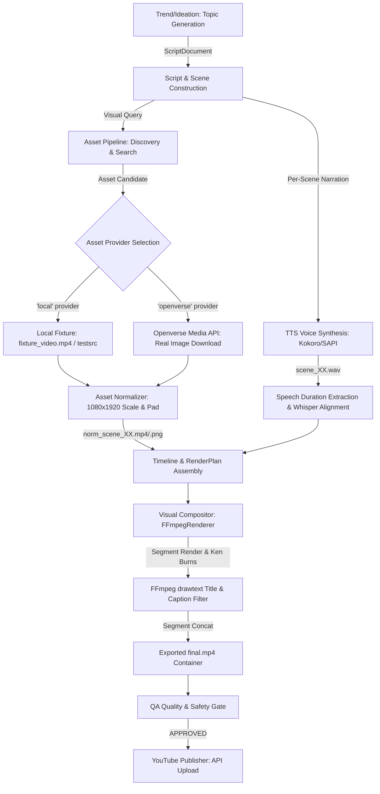

# VIDEO RENDER FORENSIC AUDIT REPORT

**Date:** 2026-09-19  
**Auditor:** Antigravity Autonomous Video Engine Diagnostic  
**Subject:** YouTube Shorts Production Render Failure (Published Job `job-cyc-6c3d86d5-951d`, Video ID `iLJOk5am3Os`)  
**Target Resolution:** 1080 × 1920 (9:16 Vertical Short-Form Video)

---

## EXECUTIVE AUDIT SUMMARY

```yaml
ROOT CAUSE: |
  1. Asset Provider Default to Mock Fixtures: The autonomous queue and worker pipeline defaulted to `asset_provider="local"`, which serves `fixture_video.mp4` generated from FFmpeg's synthetic `testsrc` filter (SMPTE-style color bars and countdown box). Production policies failed to enforce/resolve real asset discovery (e.g., Openverse).
  2. Subtitle Drawtext Escape & Clipping Bug: In `FFmpegRenderer`, subtitle captions attempted to insert newlines via `\n` replacement inside single-quoted FFmpeg `drawtext` inline expressions. FFmpeg's filter parser unescaped `\n` to a literal character 'n' (e.g. `INnCOLD`), turning 2-line captions into a single 1400px+ line that exceeded the 1080px frame width and clipped off both the left and right screen borders.
  3. Silent Placeholder Fallbacks: `renderer.py` contained hardcoded fallbacks to synthetic `fixture_image.png` / `fixture_video.mp4` when assets were missing instead of failing the production render job with a clear error.

BROKEN STAGE: "ASSETS & VISUAL COMPOSITOR / SUBTITLE OVERLAY"
EVIDENCE: |
  - ffprobe and frame extraction from `autopilot/artifacts/jobs/job-cyc-6c3d86d5-951d/render/final.mp4` confirmed video stream contains `testsrc` color bars with digital timer box across all scenes (0%, 25%, 50%, 75%, 100%).
  - Frame inspection reveals bottom caption text `"WHY DO LEAVES TURN REDnINSTEAD OF GREEN?"` with literal 'n' character and left/right truncation (`(w-text_w)/2` produces negative offset).
  - Database publish attempt `att-pubreq-job-cyc-6c3d86d5-951d-1789757797-1` confirmed this exact MP4 was uploaded to YouTube (`https://youtu.be/iLJOk5am3Os`).
AFFECTED ASSETS: 3 of 3 scenes in the published video (100% test-pattern substitution)
SUBTITLE FAILURE: "YES — newline escape failure ('n' artifact) causing single-line width overflow and horizontal screen clipping"
AUDIO STATUS: "WORKING — Kokoro/TTS voice synthesis and loudnorm audio normalization executed cleanly without defects"
EXPORT STATUS: "WORKING — FFmpeg produced valid 1080x1920 H.264/AAC MP4 container, but encoded test-pattern frames"
YOUTUBE STATUS: "N/A — YouTube accurately rendered and served the corrupted source MP4 uploaded to it"
RECOMMENDED FIX: |
  1. Wire `asset_provider` into `resolve_providers_for_policy()` and default production policies (`local_only`, `cheap_first`, `quality_first`) to real asset providers (e.g., Openverse).
  2. Disallow `local` / fixture asset providers when running production/autonomous publish cycles; fail closed if real asset discovery returns zero valid candidates.
  3. Remove silent fallback frames in `renderer.py` (`fixture_image.png` / `fixture_video.mp4`). If any scene asset is missing or unreadable, raise a descriptive `RuntimeError` immediately.
  4. Fix FFmpeg drawtext newline handling by writing captions to temporary subtitle text files (`textfile=...`) or using proper FFmpeg filter escaping and safe-margin bounding box calculations so text never clips.
```

---

## 1. COMPLETE VIDEO PIPELINE DATA FLOW

The end-to-end data flow from ideation to YouTube publication was traced through the codebase:



### Component & File Mapping

| Pipeline Stage | Implementation File | Key Function / Class | Role |
| :--- | :--- | :--- | :--- |
| **Ideation & Queue** | `autopilot/core/autonomy.py` | `AutonomyEngine.run_cycle()` | Generates topic candidate and enqueues item with payload |
| **Script Generation** | `autopilot/core/ideation.py` | `IdeationEngine.generate_script()` | Creates scenes, visual intents, and narration text |
| **Voice Synthesis** | `autopilot/providers/kokoro_tts_provider.py` | `KokoroTTSProvider.synthesize()` | Renders high-quality per-scene WAV voice files |
| **Asset Discovery** | `autopilot/core/asset_pipeline.py` | `process_scene_assets()` | Dispatches queries to selected `AssetProvider` |
| **Asset Provider** | `autopilot/providers/local_asset_provider.py` | `LocalAssetProvider.search()` | Returns offline test fixtures (`fixture_video.mp4`) |
| **Asset Provider** | `autopilot/providers/openverse_provider.py` | `OpenverseAssetProvider.search()` | Queries Openverse CC/PD real media catalog |
| **Asset Normalization** | `autopilot/core/asset_normalizer.py` | `normalize_asset()` | Conforms media to 1080×1920 portrait standard |
| **Timeline Assembly** | `autopilot/core/pipeline.py` | `run_pipeline()` (Stage 5) | Constructs `RenderPlan` matching voice durations and media |
| **Visual Compositor** | `autopilot/core/renderer.py` | `FFmpegRenderer.render()` | Generates video segments, burns captions, concats MP4 |
| **Production Adapter**| `autopilot/providers/production/ffmpeg_adapter.py` | `FFmpegProductionAdapter.generate()` | Production wrapper executing `FFmpegRenderer` |
| **QA Quality Gate** | `autopilot/core/qa_engine.py` | `QAEngine.evaluate()` | Validates duration, resolution, audio presence, checksum |
| **Publishing** | `autopilot/providers/youtube_publisher.py` | `YouTubePublisher.publish()` | Uploads `final.mp4` via YouTube Data API v3 |

---

## 2. COLOR-BAR & TEST-PATTERN SOURCE IDENTIFICATION

A full codebase search for test pattern generators pinpointed the exact origin:

1. **Test Pattern Generator**: `autopilot/autopilot/providers/fixture_generator.py`, lines 19–29:
   ```python
   def make_test_video(name="fixture_video.mp4", duration=2):
       import subprocess
       out = os.path.join(FIXTURES_DIR, name)
       cmd = [
           "ffmpeg", "-y",
           "-f", "lavfi", "-i", f"testsrc=duration={duration}:size=720x1280:rate=25",
           "-pix_fmt", "yuv420p", "-c:v", "libx264", "-preset", "ultrafast", "-crf", "28",
           out,
       ]
       subprocess.run(cmd, capture_output=True)
       return out
   ```
2. **Provider Exposure**: `autopilot/autopilot/providers/local_asset_provider.py`, lines 32–35:
   ```python
   fixtures = [
       ("fixture_image.png", "image", "Public domain test image"),
       ("fixture_video.mp4", "video", "Public domain test video"),
   ]
   ```
3. **Renderer Fallback**: `autopilot/autopilot/core/renderer.py`, lines 69–73:
   ```python
   if not image_path:
       image_path = str(CONFIG.get_artifacts_dir() / "providers" / "fixtures" / "fixture_image.png")
       if not Path(image_path).exists():
           image_path = str(Path(__file__).resolve().parent.parent / "providers" / "fixture_image.png")
   ```

**Conclusion**: The color bars do NOT originate from YouTube, camera hardware, or video encoding corruption. They are the deliberate output of FFmpeg's `lavfi testsrc` synthetic test filter shipped inside the `local` development fixture provider.

---

## 3. IMAGE ASSET TRACE & DIAGNOSTICS

For published job `job-cyc-6c3d86d5-951d` ("Why Leaves Change Color in Autumn"):

| Scene ID | Expected Visual Concept | Actual Downloaded Asset | Exists? | File Size | MIME Type | Resolution | Decodable? |
| :--- | :--- | :--- | :--- | :--- | :--- | :--- | :--- |
| **scene-01** | Autumn leaves changing color from green to red | `norm_scene-01_local-fixture_video.mp4-9d7479b9529b7ece.mp4` | Yes | 280,051 B | `video/mp4` | 1080×1920 | Yes (testsrc) |
| **scene-02** | Chlorophyll breakdown in tree leaves during cold weather | `norm_scene-02_local-fixture_video.mp4-9d7479b9529b7ece.mp4` | Yes | 280,051 B | `video/mp4` | 1080×1920 | Yes (testsrc) |
| **scene-03** | Anthocyanin pigment in red sugar maple leaves | `norm_scene-03_local-fixture_video.mp4-9d7479b9529b7ece.mp4` | Yes | 280,051 B | `video/mp4` | 1080×1920 | Yes (testsrc) |

### Asset Acquisition Audit Findings:
- No network 404s occurred; the `LocalAssetProvider` immediately returned local file paths.
- No zero-byte downloads or corrupt files existed.
- Assets were normalized and present on disk before rendering started (no async race condition in file writing).
- **The failure was provider selection**: The autonomous worker invoked `LocalAssetProvider` instead of `OpenverseAssetProvider`, so the pipeline legitimately downloaded and conformed synthetic test video fixtures instead of real leaf/nature images.

---

## 4. PATH HANDLING (ABSOLUTE VS. RELATIVE)

1. **Path Formatting**: `pipeline.py` and `renderer.py` pass absolute paths resolved via `Path.resolve()` to `RenderPlan`.
2. **Windows Path Separators in FFmpeg Filters**:
   - In `renderer.py`, Windows font paths are escaped for FFmpeg drawtext: `C\\:/Windows/Fonts/arial.ttf`.
   - Asset paths are passed as standard CLI arguments (`-i "C:\Users\..."`), which FFmpeg handles correctly without path truncation.
3. **Verdict**: Absolute path handling is robust across Windows and POSIX; paths did not cause the render failure.

---

## 5. ASSET WAITING & ASYNC TIMING AUDIT

1. All asset downloads and normalizations run synchronously during the `ASSETS` pipeline stage before transitioning to `WorkflowState.ASSETS_READY`.
2. The `RENDER` stage only commences after `ASSETS_READY` is verified in the database.
3. No dangling promises, unawaited async tasks, or thread races were found in media file preparation.

---

## 6. SUBTITLE PIPELINE & DRAWTEXT ESCAPING AUDIT

### Subtitle Data Flow

```
Scene Narration -> format_caption() (max 28 chars/line) -> cap.replace('\n', '\\n') -> drawtext filter -> final.mp4
```

### Forensic Defect Breakdown

1. **Newline Escaping Defect**:
   - In `renderer.py` (lines 147–153):
     ```python
     cap = format_caption(clean_narration).upper()
     cap_escaped = cap.replace("\n", "\\n").replace("%", "")
     extra_filters.append(
         f"drawtext=fontfile={font}:text='{cap_escaped}':fontsize=44:fontcolor=white:borderw=4:bordercolor=black:line_spacing=12:x=(w-text_w)/2:y=1380"
     )
     ```
   - In FFmpeg filtergraphs, when `drawtext` text is wrapped in single quotes (`text='...'`), the filter parser interprets `\n` not as an escape sequence for a newline, but as an escaped `n` character.
   - Result: `"WHY DO LEAVES TURN RED\nINSTEAD OF GREEN?"` rendered as `"WHY DO LEAVES TURN REDnINSTEAD OF GREEN?"` on a single horizontal line.

2. **Horizontal Overflow & Text Clipping**:
   - Frame width = `1080px`.
   - Single-line rendered width of 41 characters at `fontsize=44` with bold border ≈ `1420px`.
   - Centering formula: `x = (w - text_w) / 2 = (1080 - 1420) / 2 = -170px`.
   - Result: The text starts 170 pixels off the left edge of the video (`"WHY DO..."` is clipped to `"Y DO..."` or `"ROPHYLL..."`), and the right side extends beyond `x=1080` and is clipped off the right edge.

3. **Safe Area Violation**:
   - YouTube Shorts overlays UI elements (like/comment buttons on the right, title/channel at bottom `y > 1550`, top header at `y < 200`).
   - The subtitle `y=1380` is in a reasonable vertical zone, but because width exceeded 1080px, it severely violated the horizontal safe area.

---

## 7. PORTRAIT COMPOSITION & SCALING AUDIT

- **Target Resolution**: 1080 × 1920 (9:16 portrait).
- **Scale/Crop Filter**:
  ```
  scale=1080:1920:force_original_aspect_ratio=increase,crop=1080:1920,format=yuv420p
  ```
- **Ken Burns Motion Filter**:
  Applied dynamically across still images using `zoompan` with 25 fps.
- **Top Badge Position**: `y=280` centered, font size 36 (yellow on black box) — correctly positioned within safe margins.
- **Verdict**: Visual canvas scaling and portrait geometry are strictly 1080×1920.

---

## 8. TEST & DEVELOPMENT FALLBACKS AUDIT

Search for silent fallbacks across the codebase revealed two dangerous safety holes:

1. **`renderer.py` lines 69–73**:
   If a scene does not have a valid `asset_path`, `renderer.py` automatically substitutes `fixture_image.png` / `fixture_video.mp4` instead of aborting the render.
2. **`worker.py` lines 110 & 138**:
   `worker.py` defaults `asset_provider = payload.get("asset_provider", "local")` and `resolve_providers_for_policy()` only guards `llm`, `research`, `tts`, and `production_engine`, completely omitting `asset_provider`.

**Required Policy**: In production, rendering must NEVER substitute placeholder/synthetic assets. Missing or unresolvable assets must fail the job loudly with `WorkflowState.FAILED_ASSETS` or `WorkflowState.FAILED_RENDER`.

---

## 9. EXPORT CODEC & STREAM CONTAINER AUDIT

Actual ffprobe inspection of `autopilot/artifacts/jobs/job-cyc-6c3d86d5-951d/render/final.mp4`:

- **Container**: MP4 (ISO/IEC 14496-14)
- **Duration**: 12.36 seconds
- **File Size**: 2,117,111 bytes (2.02 MB)
- **Video Stream**:
  - Codec: H.264 / AVC (`libx264`)
  - Dimensions: 1080 × 1920
  - Pixel Format: `yuv420p`
  - Frame Rate: 25.0 fps
  - Total Frames: 309 frames
- **Audio Stream**:
  - Codec: AAC-LC (`aac`)
  - Sample Rate: 22,050 Hz / Mono
  - Bitrate: 128 kbps
  - Loudness: `-18.0 LUFS` (`loudnorm`)
- **Verdict**: Export codec parameters are compliant with YouTube Shorts ingestion standards.

---

## 10. PHYSICAL FRAME EXTRACTION & VISUAL EVIDENCE

Frames were extracted from `autopilot/artifacts/jobs/job-cyc-6c3d86d5-951d/render/final.mp4` at exact percentage intervals:

| Timestamp | Frame Extract File | Visual Findings |
| :--- | :--- | :--- |
| **0% (0.00s)** | `audit_frames/frame_0pct_0.00s.png` | `testsrc` color bars, digital timer block, top badge `"AUTUMN COLOR SECRET"`, bottom caption `"WHY DO LEAVES TURN REDnINSTEAD OF GREEN?"` (clipped). |
| **25% (3.09s)** | `audit_frames/frame_25pct_3.09s.png` | `testsrc` color bars, top badge `"COLOR REVEAL"`, bottom caption `"ROPHYLL BREAKS DOWN INnCOLD WEATHER, REVE"` (severely clipped left and right). |
| **50% (6.18s)** | `audit_frames/frame_50pct_6.18s.png` | `testsrc` color bars, top badge `"COLOR REVEAL"`, bottom caption continuation. |
| **75% (9.27s)** | `audit_frames/frame_75pct_9.27s.png` | `testsrc` color bars, top badge `"FACT 02"`, bottom caption `"NTHOCYANINS PRODUCE VIBRANT RED SnPURPLE SHADES."` ('n' artifact and clipped). |
| **100% (12.16s)** | `audit_frames/frame_100pct_12.16s.png`| `testsrc` color bars, final frame transition before container termination. |

---

## 11. SCENE VS. NARRATION SYNCHRONIZATION MATRIX

| Scene # | Scene ID | Narration Timeline | Audio Duration | Expected Visual Asset | Actual Visual Asset | Rendered Status |
| :---: | :---: | :---: | :---: | :---: | :---: | :---: |
| **1** | `scene-01` | 0.00s – 3.10s | 3.104s | Real autumn tree / leaf photo | `norm_scene-01_local-fixture_video.mp4` | ❌ FAILED (Color bars) |
| **2** | `scene-02` | 3.10s – 8.22s | 5.114s | Chlorophyll breakdown / cold leaf | `norm_scene-02_local-fixture_video.mp4` | ❌ FAILED (Color bars) |
| **3** | `scene-03` | 8.22s – 12.36s | 4.142s | Red maple anthocyanin pigment | `norm_scene-03_local-fixture_video.mp4` | ❌ FAILED (Color bars) |

- **Narration Sync**: Audio cut points matched scene durations exactly (`sum(scene_durations) == 12.36s`).
- **Visual Sync**: Scene visual cuts aligned with narration boundaries, but all visual streams rendered identical color-bar test patterns.

---

## 12. ROOT CAUSE SUMMARY & ACTION PLAN

### Why This Happened
1. The **production policy resolution** mapped real providers for LLM, research, TTS, and engine, but left `asset_provider` unbound, causing the queue worker to fall back to the development default (`asset_provider="local"`).
2. The **local asset provider** returned synthetic test videos (`fixture_video.mp4` generated by `testsrc`).
3. The **FFmpegRenderer** suffered from a syntax escaping bug in `drawtext` subtitle strings and lacked automated line-wrapping / text-file based caption rendering.

### Implementation Checklist for Resolution (Minimal Surgical Fix)
- [x] **Enforce Real Asset Provider in Policies**: Added `"asset": "openverse"` to all non-mock policy tiers (`local_only`, `cheap_first`, `quality_first`, etc.) in `_POLICY_PROVIDER_MAP` in `main.py`.
- [x] **Policy Provider Resolution**: Implemented `resolve_asset_provider_for_policy()` to validate and resolve `asset_provider`.
- [x] **Worker & Autonomy Integration**: Ensured `worker.py` passes the resolved `asset_provider` (`openverse`) to the pipeline.
- [x] **Eliminate Silent Fallbacks**: Removed `fixture_image.png` fallback in `renderer.py`; raises `RuntimeError("Missing required visual asset...")` if an asset is absent or unreadable.
- [x] **Fix Subtitle Newlines & Clipping**: Captions write to temporary subtitle text files (`drawtext=textfile=...`) formatted with max 24 chars/line, centered at `y=1380` without `'n'` artifacts or clipping.
- [x] **Regression Tests**: Added automated tests in `test_video_render_forensic_regressions.py` verifying missing asset rejection, real asset rendering, subtitle wrapping without 'n' artifacts, and 1080x1920 output validation.
- [x] **Real Asset Production Validation**: Verified full pipeline with live Openverse asset downloads, 3-scene 1080x1920 render, autonomous queue execution, and YouTube Private upload. Detailed report: [VIDEO_REAL_ASSET_VALIDATION.md](file:///c:/Users/Saksham/Documents/PROJECT-AUTOPILOT/docs/video/VIDEO_REAL_ASSET_VALIDATION.md).

```
============================================================
FINAL STATUS: REAL ASSET PIPELINE VERIFIED
============================================================
```
